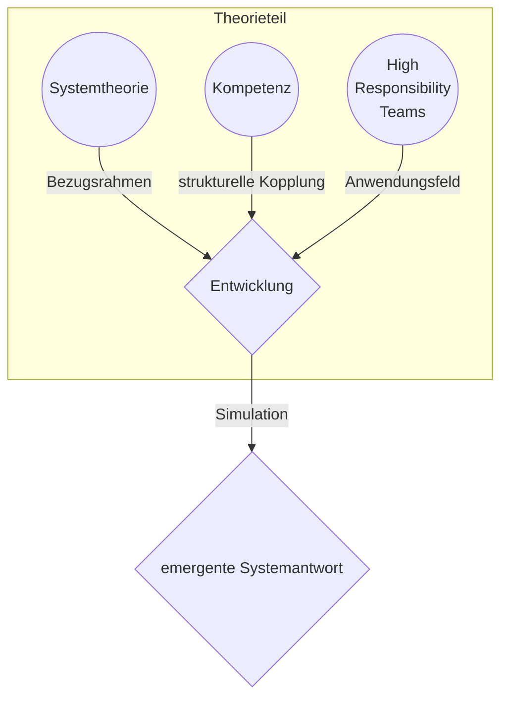

created: 13.4.2025 | [updated](https://git.jochen-hanisch.de/jochen-hanisch/vortraege): 30.4.2025 | [publishd](https://zenodo.org/records/15384253): 30.4. 2025 | [Austausch](https://lernen.jochen-hanisch.de/course/view.php?id=4) | [[Allgemein beruflich/Webseite/Metadaten/Hinweise]]

# Ringvorlesung Rettungswissenschaften 2025

## Systemische Kompetenzentwicklung für High Responsibility Teams

### Eine fundierte Analyse der theoretischen und praktischen Aspekte von Kompetenzentwicklung in dynamischen Arbeitsumgebungen

30.04.2025, [[Wissenschaftler|Jochen Hanisch, M.A., M.A.]]

Vielen Dank für die Gelegenheit zum Vortragen meiner Gedanken an:

[HSD Hochschule Döpfer GmbH](https://www.hs-doepfer.de/events/ringvorlesung-rettungswissenschaften-2025) | [Fliedner Fachhochschule gGmbH](https://www.fliedner-fachhochschule.de/offene-ringvorlesung-rettungswissenschaft/)

---

### Vortragspfad

_Abbildung 1: Vortragspfad (eig. Darstellung)_

---
### Systemischer Ansatz – Definition

>Der **systemische Ansatz** bezeichnet ein interdisziplinäres Set von Konzepten und Denkhaltungen zur Beschreibung, Analyse und Gestaltung komplexer Systeme. Er rückt das Zusammenspiel individueller, sozialer, kultureller und institutioneller Faktoren in den Fokus und betrachtet diese in ihrer wechselseitigen Abhängigkeit (Interdependenz).

| Anwendung                                                 | Merkmale                                                                    |
| --------------------------------------------------------- | --------------------------------------------------------------------------- |
| Pädagogik, Organisationsentwicklung, Soziale Arbeit | Ganzheitlichkeit, zirkuläre Kausalität, Dynamik systemischer Prozesse |

> „Systeme sind mehr als die Summe ihrer Teile. Entscheidend ist das Muster ihrer Verbindungen.“ _(Gregory Bateson, 1972)_
> 
> „Systeme sind operativ geschlossen, aber strukturell an ihre Umwelt gekoppelt.“ _(Niklas Luhmann, 1984)_
> 
> „Systemisches Denken bedeutet, die Welt in Beziehungen zu sehen.“ _(Fritz B. Simon, 2001)_

---

## Vera Hagemann (2011) - Merkmale High Responsibility Teams

| Konsequenzen von Teamprozessen       | Klassische Teams              | High Responsibility Teams                   |
| ------------------------------------ | ----------------------------- | ------------------------------------------- |
| Reversibilität der Ereignisse?       | In der Regel ja               | In der Regel nein                           |
| Körperliche und psychische Schäden?  | Nein                          | Ja                                          |
| Wem wird geschadet?                  | Dem Team und der Organisation | Dem Team, der Organisation und Dritten      |
| Verantwortung für das Leben anderer? | Nein                          | Ja                                          |
| Abbruch der Situation möglich?       | Ja                            | Nein                                        |
| Arbeitsunterbrechung möglich?        | Pausen etc. sind möglich      | Pausen etc. sind in der Regel nicht möglich |
| Mediendruck / Öffentlichkeit?        | In der Regel nicht            | Ja                                          |

>Arbeiten im Rettungsdienst High Responsibility Teams?
>
>Ja!
>
>"Insbesondere bei invasiven Maßnahmen ist eine Handlung nicht reversible und kann zu körperlichen und psychischen Schäden führen. Bei Störungen einer der Vitalfunktionen (Bewusstsein, Atmung, Kreislauf) übernehmen rettungsdienstliche Teams Verantwortung für das Leben ihrer Patienten/innen. Bei der Durchführung der Einsätze ist eine Arbeitsunterbrechung nicht möglich und bei einem fehlerhaften Verhalten kann der Druck der Öffentlichkeit insbesondere medial sehr groß werden." (Hanisch, 2020)

---
## Tradierter Kompetenzbegriff

Kompetenzbegriff rückt ab Mitte der 1980er Jahre stärker in den Fokus – insbesondere im deutschsprachigen Raum.

Allerdings reichen die theoretischen Wurzeln weiter zurück:

- **Chomsky (1965)** führte den Begriff „Kompetenz“ („linguistic competence“) ein, im Gegensatz zur „Performanz“ – also dem tatsächlichen Sprachgebrauch. Das war allerdings ein stark kognitionswissenschaftlich geprägter Zugang.
- In den **1970er Jahren** wurde der Begriff in den USA im Kontext von „Competency-Based Education and Training“ (CBET) als Reaktion auf wirtschaftliche Anforderungen populär. Ziel war es, Bildungsprozesse stärker an beobachtbaren Leistungen und beruflicher Handlungsfähigkeit auszurichten.
- Der deutschsprachige Bildungsdiskurs griff diesen Ansatz **in den 1990ern** auf, z. B. durch die Arbeiten von **Franz E. Weinert**, der „Kompetenz“ als „die bei Individuen verfügbaren oder durch sie erlernbaren kognitiven Fähigkeiten und Fertigkeiten, um bestimmte Probleme zu lösen“ definierte – ergänzt durch motivationale und soziale Bereitschaften.

---

### Franz E. Weinert (2001) – Der „OECD-Kompetenzbegriff“

**Kontext**

Weinert entwickelte seinen Kompetenzbegriff im Rahmen von PISA, um ein internationales, empirisch überprüfbares Verständnis von Lernergebnissen zu ermöglichen.

**Definition**
> „Kompetenzen sind bei Individuen verfügbare oder durch sie erlernbare kognitive Fähigkeiten und Fertigkeiten, um bestimmte Probleme zu lösen, sowie die damit verbundenen motivationalen, volitionalen und sozialen Bereitschaften, um die Problemlösungen in variablen Situationen erfolgreich und verantwortungsvoll nutzen zu können.“

**Merkmale**
- Betonung von **Kognition**, **Motivation**, **Sozialverhalten**
- Fokus auf **Anwendbarkeit in variablen Situationen**
- Grundlage für **Output-orientierte Bildungssteuerung** (Learning Outcomes)

**Kritik**
- Deutlich **pragmatisch-funktionalistisch**, wenig Raum für Bildung im emphatischen Sinn
- Problematisch für nicht direkt prüfbare Lernprozesse (z. B. ethische Haltungen)

---

### Ökonomisierung und Funktionalisierung

Kompetenzdiskurs war **ökonomisch motiviert**.

Die sogenannte „Employability“-Debatte, insbesondere im Rahmen von **OECD-Initiativen** (z. B. PISA ab 2000), hat stark zur Verbreitung beigetragen:

- Bildung wurde zunehmend unter dem Aspekt der **ökonomischen Verwertbarkeit** betrachtet. Die Leitfrage: Was kann jemand in einer konkreten Situation leisten?
- Die Idee war, **outputs** statt inputs (z. B. Stoffpläne, Unterrichtsinhalte) zu messen – also Lernergebnisse statt Lerninhalte.
- Im Zuge der **Bologna-Reform** wurde der Kompetenzbegriff zum zentralen Strukturierungsprinzip von Hochschulabschlüssen (Stichwort: Learning Outcomes, ECTS, Qualifikationsrahmen).

Insofern war der Kompetenzbegriff – so wie er in der beruflichen Bildung und allgemeinen Bildung rezipiert wurde – **kein genuin pädagogischer Begriff**, sondern ein **steuerungstechnisches Instrument** mit starker Verankerung in Wirtschaft und Bildungsverwaltung.

---

### Berufspädagogische Modelle (z. B. KMK „berufliche Handlungskompetenz“)

**Definition (KMK, 1996):**
> „Berufliche Handlungskompetenz umfasst Fachkompetenz, Sozialkompetenz und Selbstkompetenz.“

**Ausdifferenzierung**

- **Fachkompetenz**: Fachwissen und Fachkönnen
- **Sozialkompetenz**: Teamfähigkeit, Kommunikation
- **Selbstkompetenz**: Eigenverantwortung, Kritikfähigkeit

**Merkmale**
- Eng mit dem Leitbild der **Handlungsorientierung** in der Berufsausbildung verknüpf
- Grundlage für viele **Curricula in der dualen Ausbildung**

**Kritik**
- **Stark normativ**, wenig Raum für kreative oder nicht-lineare Entwicklungen
- Teilweise **schematische Anwendung** ohne Reflexion der Lernkontexte

---

### Dieter Mertens & Reinhold Erpenbeck – Kompetenz als Selbstorganisationsfähigkeit

**Kontext**

Insbesondere Erpenbeck (ab 2006) entwickelt ein stark **systemtheoretisch und konstruktivistisch** geprägtes Modell mit Bezug zur Berufsbildung und Personalentwicklung.

**Definition (Erpenbeck)**

> „Kompetenz ist die Fähigkeit, in offenen, unüberschaubaren, dynamischen Situationen selbstorganisiert zu handeln.“

**Merkmale**
- **Strukturmodell (z. B. KODE$^{®}$)**: **Personale Kompetenz** (z. B. Selbstreflexion, Motivation), **Fachliche Kompetenz** (z. B. Wissen, Methoden), **Sozial-kommunikative Kompetenz** & **Aktivitäts- und Handlungskompetenz** (z. B. Eigeninitiative, Umsetzungsstärke)
- **Handlungstheoretischer Fokus**, Betonung von **Selbststeuerung** und **Situationsbewältigung**, Hohe Nähe zur Kompetenzdiagnostik in Unternehmen

**Kritik**
- Gefahr der **Verhaltensnormierung** („unternehmerisches Selbst“) 
- Theoretisch anspruchsvoll, aber praktisch schwer zu operationalisieren

---

### Übertragung auf schulische und pädagogische Kontexte

Die Übertragung des Kompetenzbegriffs auf Schule und Unterricht war in vielen Fällen **systemfremd**:

- Schule arbeitet traditionell mit **Bildungsbegriffen** (z. B. Humboldt’sche Bildungsideale, personale Entfaltung, Weltbezug), die nicht primär funktionalistisch geprägt sind.
- Die **Didaktik** hat sich teilweise schwergetan, den Kompetenzbegriff sinnvoll zu integrieren – besonders in Fächern mit starkem normativem, ästhetischem oder kulturellem Bezug (z. B. Ethik, Kunst, Musik).
- Gleichwohl bot er **Möglichkeiten zur Reform**: Kompetenzorientierte Curricula haben versucht, **Lernziele transparenter** und **individuelle Förderung** stärker zu strukturieren.

---
### Klieme et al. (2003) – Kompetenzmodelle für die Bildungsstandards

**Kontext**

Entwickelt im Auftrag der Kultusministerkonferenz (KMK) zur Definition nationaler Bildungsstandards.

**Struktur**
- **Domänenspezifische Kompetenzen**, z. B. mathematische, naturwissenschaftliche oder sprachliche Kompetenzen    
- Modellierung über **Kompetenzstufen** (z. B. PISA, Bildungsstandards)

**Merkmale**
- **Curricular valide** (an Lehrplänen orientiert)    
- Empirisch prüfbar durch **Aufgabenformate**
- Grundlage für **standardbasierten Unterricht**

**Kritik**
- **Reduktion auf testbare Teilkompetenzen**  
- **Kulturbildende Aspekte** von Bildung geraten in den Hintergrund

---

### Inflationärer Gebrauch und Kritik

Kompetenzbegriff wird **inflationär** verwendet, Kritikpunkte lauten u. a.:

- **Begriffsunschärfe**: Kompetenz ist ein Containerbegriff geworden, der je nach Autorin, Institution oder Kontext unterschiedlich definiert wird.
- **Operationalisierungsprobleme**: Nicht alles, was als „Kompetenz“ benannt wird, lässt sich angemessen beobachten, prüfen oder bewerten.
- **Reduktionismus**: Bildung wird auf performative, nützliche Aspekte reduziert – auf „was jemand kann“, nicht auf „wer jemand wird“.

---

## Aktuelles Kompetenzverständnis

**⇒ Begriffsverständnis unscharf und uneinheitlich**
- weit vs. eng
- für den HRT-Kontext eher Maßnahmenbeschreibung (Algorithmen-basiert)

**⇒ Schärfung notwendig**
- rechtliche Forderungen (z.B. NotSanG, NotSan-APrV)
- Eigenverantwortung der Handelnden gefordert (bestärkt durch VGH München (_Ausübung heilkundlicher Tätigkeiten durch Notfallsanitäter_, 2021))

>„Mobilisierung des Wissens“ _(Erpenbeck & Sauter, 2019)_

>"Fähigkeit, selbstorganisiert und kreativ von einmal bewussten, gelernten, getanem ausgehend Neues zu schaffen, neuartige Probleme zu lösen, neue Denkweisen zu begründen“ _(Erpenbeck & Rosenstiel, 2007)_

---
### Determinanten-Substitution (semantisch)

>"Fähigkeit, selbstorganisiert und kreativ von einmal bewussten, gelernten, getanem ausgehend Neues zu schaffen, neuartige Probleme zu lösen, neue Denkweisen zu begründen“ _(Erpenbeck & Rosenstiel, 2007)_

| Dimension                      | Quelle & Zitat                                                                                                                                                              |
| ------------------------------ | --------------------------------------------------------------------------------------------------------------------------------------------------------------------------- |
| a) **Fähigkeit**            | „Individuelle Bereitschaft, Leistung zu zeigen“    *Tenorth & Tippelt (2007), Fähigkeit*                                                                              |
| b) **Spezifische Leistung** | „bewussten, gelernten, getanem“    *Erpenbeck et al. (2007)*                                                                                                          |
| c) **selbstorganisiert**    | „System in Operation [...], relativiert auf ein Thema der Gleichzeitigkeit, der Gegenwart, der Aktualität [...] um Strukturen benutzen zu können“    *Luhmann (2017)* |
| d) **kreativ**              | „[…] relative […] Neuheit […]. […] Angemessenheit bzw. Brauchbarkeit der (neuen) Problemlösung […]“    *Wirtz (2020), Kreativität*                                    |
| f) **neue Denkweise**       | „Vorbereitungen zum geplanten Handeln“ ⇒ staatliche Prüfungen  *Wirtz (2020), Denken*                                                                                 |

---

### Determinanten-Substitution (sematisch)

>"Fähigkeit, selbstorganisiert und kreativ von einmal bewussten, gelernten, getanem ausgehend Neues zu schaffen, neuartige Probleme zu lösen, neue Denkweisen zu begründen“ _(Erpenbeck & Rosenstiel, 2007)_

**e) Neuartige Probleme**

„eine Art der Denkanforderung [...], die durch drei Komponenten gekennzeichnet sein soll _(Wirtz, „Problem“, 2020)_:

1. unerwünschter Anfangszustand,
2. erwünschter Endzustand,
3. Barriere, die die Transformation von (1) in (2) zunächst verhindert.“

**Für rettungsdienstliche Anfangszustände gilt einschränkend:**

- entsprechende Situationen weisen ähnliche Merkmale auf, die in zuvor erlebten Situationen bewältigt werden konnten

Systemisch-konstruktivistisch ist Absicht oder Ziel irrelevant (Wirkungsorientierung, i.A.a. Arnold, 2010, S. 76, Abb. 20) (vgl. [[Wirkungswahrscheinlichkeit]], [[Wirkungskriterienbasierte Entscheidungsfindung]])

**⇒ erwünsche Wirkung ist mit einzubeziehen**

---

### Kompetenzdefinition High Responsibility Teams

>„Kompetenz im Kontext von High Responsibility Teams ist die individuelle Bereitschaft, Operationen auf ausbildungsrechtlichen Grundlagen zu planen, deren Wirkung zu angemessenem und brauchbarem Handeln führt, um Transformationsbarrieren vom unerwünschten zum erwünschten Zustand zu überwinden.“ (Hanisch, 2023)

**Prämissen**

1. Der unerwünschte Zustand ist gegenwärtig und die Transformationsbarrieren sind durch (evidenzbasierte) Operationen veränderbar.
2. High Responsibility Teams werden auf gesetzlichen Grundlagen ausgebildet und geprüft.
3. Der Handlungsbereich ist abgegrenzt.

(vgl. [[High Responsibility Team Decision Framework]])

---

### Systemtheorie und die VUCA-Welt

In High Responsibility Teams (HRTs) trifft die operative Geschlossenheit sozialer Systeme (Luhmann, 1984) auf eine Umwelt, die durch VUCA-Bedingungen geprägt ist:

| VUCA-Komponente | Bedeutung           | Systemtheoretischer Bezug             |
|-----------------|---------------------|---------------------------------------|
| **Volatility**  | Rascher Wandel      | Erhöhte Irritation                    |
| **Uncertainty** | Unsicherheit         | Kontingenzverarbeitung                |
| **Complexity**  | Vielschichtigkeit    | Selektive Strukturierung              |
| **Ambiguity**   | Mehrdeutigkeit       | Differenzierende Selbstbeschreibung   |

> In der VUCA-Welt wird **Bildung zur Form systemischer Selbstanpassung** – nicht als Reaktion, sondern als **strukturierte Verarbeitung von Unwahrscheinlichkeit über Zeit**.

---

### Arn & Munsch (2022) - Paradigmenwechsel durch Entwicklungsorientierung

**Postulat der aufeinander aufbauenden Bildungsparadigmen**
(vorherigen Ebenen bleiben erhalten)
1. Wissensorientierung
2. Kompetenzorientierung
3. Entwicklungsorientierung

**Ursprünge u.a. in Systemischer Beratung**

Kognitives, emotionales und soziales Verhalten des Menschen wird durch disponierten Auslöser getriggert
- Veränderung von Form und Verhalten der Lebewesen
- Vorwärts gerichteter Prozess (Fähigkeiten, Fertigkeiten und Eigenschaften)

**Grenzen der Kompetenzorientierung**

- Die Kategorie Kompetenz stößt an Grenzen
- Grenzüberschreitungen sind für Bildungsfragen wichtig
- Keine passende Bezeichnung
- Entwicklung ist bekannt

>"Operationalisierung endet bei den Begriffen Verantwortlichkeit, Kreativität, kritisches Denken"

---

## Übergang: Vom Theorieteil zur Simulation

- Die theoretischen Grundlagen sind gelegt (vgl. [[Allgemein beruflich/Research/Bildungswissenschaft/Kompetenzentwicklung|Kompetenzentwicklung]]):
  - Systemtheorie als strukturgebender Bezugsrahmen (Luhmann)
  - Kompetenz als strukturelle Kopplung an Umwelterwartungen
  - Kontextualisierung durch High Responsibility Teams (HRTs) in der VUCA-Welt

- Im nächsten Schritt erfolgt die Übertragung in eine simulationsbasierte Modellierung:
  - Darstellung des Bildungswirkgefüges
  - Visualisierung von Einflussfaktoren und Entscheidungsprozessen
  - Untersuchung dynamischer Wechselwirkungen unter realistischen Bedingungen

→ Nächster Abschnitt: Modellarchitektur und Funktionslogik

---

### Eingabewerte & Begründung

Die Werte wurden **nicht willkürlich**, sondern im **Spannungsfeld zwischen Theoriemodell, Praxisbezug und Visualisierbarkeit** gewählt:

| Parameter                   | Wert  | Begründung                                                                                                                                                                                                                                     |
| --------------------------- | ----- | ---------------------------------------------------------------------------------------------------------------------------------------------------------------------------------------------------------------------------------------------- |
| **quartale**                | 12    | - 1 Quartal = ca. 3 Monate - Abbildung eines vollständigen Ausbildungszeitraums mit Übergangs-, Konsolidierungs- und Wachstumsphasen                                                                                                        |
| **simulations_durchlaeufe** | 25    | - Visuelle Vergleichbarkeit einzelner Kurvenverläufe - Monte-Carlo-Simulationen im Hintergrund: ≧ 15.000 Durchläufe                                                                                                                         |
| **initial_neugier**         | 3.066 | - Basierend auf der *Fünfdimensionalen überarbeiteten Neugier-Skala (5DCR)* (Grüning & Lechner, 2022) - Gewichteter Mittelwert aus Offenheit, Impulsivität, Explorationsfreude - Referenzwerte: Näherung = 4.333 ; Demonstration = 5.000 |
| **start_kompetenz**         | 1.333 | - Abgeleitet aus dem *Kompetenz-Reflexions-Inventar (KRI)* (Kauffeld, 2021) - Idealwert laut KRI ≈ 4.733 - APrVO-Niveau (NotSan-Ausbildung) ≈ 1.133 - Repräsentiert einen **moderat herausfordernden Anfangszustand**                 |

---

### Persönliche Ereignisse (PE)

**Funktion, Gewichtung & systemische Bedeutung**

- PE wirken als **stochastische, biografisch eingebettete Perturbationen** – nicht als lineare Ursachen.
- Sie initiieren oder hemmen Kompetenzentwicklung über **emotionale, kognitive und motivationale Reaktionsmuster**.
- Ihre Gewichtung folgt dem **Transformationspotenzial innerhalb individueller Lernverläufe**.

| Typ                            | Kürzel                                                                                                                                | Gewichtung | Begründung                                                      |
| ------------------------------ | ------------------------------------------------------------------------------------------------------------------------------------- | ---------- | --------------------------------------------------------------- |
| Familiäre Ereignisse           | [[Allgemein beruflich/Research/Bildungswissenschaft/Kompetenzentwicklung#2.3.1 Familiäre Ereignisse (PFE)\|PFE]]                      | 0.15       | Reorganisation von Rollen, Beziehungen und Selbstbildern        |
| Bedeutende Lebensveränderungen | [[Allgemein beruflich/Research/Bildungswissenschaft/Kompetenzentwicklung#2.3.2 Bedeutende Lebensveränderungen (PLE)\|PLE]]            | 0.10       | Destabilisierung etablierter Muster, Förderung von Flexibilität |
| Finanzielle Veränderungen      | [[Allgemein beruflich/Research/Bildungswissenschaft/Kompetenzentwicklung#2.3.3 Finanzielle Veränderungen (PFV)\|PFV]]                 | 0.15       | Ressourcenverengung als Auslöser strategischen Planens          |
| Gesundheitliche Veränderungen  | [[Allgemein beruflich/Research/Bildungswissenschaft/Kompetenzentwicklung#2.3.4 Gesundheitliche Veränderungen (PGV)\|PGV]]             | 0.10       | Einschränkung und Selbstfürsorge als Lernanlass                 |
| Soziale Ereignisse             | [[Allgemein beruflich/Research/Bildungswissenschaft/Kompetenzentwicklung#2.3.5 Soziale Ereignisse (PSE)\|PSE]]                        | 0.20       | Modifikation sozialer Identität und Beziehungskompetenz         |
| Persönliche Erfolgserlebnisse  | [[Allgemein beruflich/Research/Bildungswissenschaft/Kompetenzentwicklung#2.3.6 Persönliche Erfolge und Herausforderungen (PEE)\|PEE]] | 0.05       | Reflexion über Selbstwirksamkeit und Leistungsgrenzen           |

- [[Persönliche Ereignisse]] sind keine Störgrößen, sondern **bildungstragende Impulse**.
- Ihre Wirkung entfaltet sich über **subjektive Deutung**, nicht über objektive Tragweite.
- Besonders relevant für:
  - **Simulationsbasierte Modellierung individueller Bildungsbiografien**
  - **Reflexive Selbstbeobachtungsprozesse**
  - **Kompetenzdiagnostik unter Unsicherheitsbedingungen**

---

### Ergebnisübersicht – Simulation (konstruktivistisch | Standardlernender)

Die folgenden Darstellungen wurden automatisiert aus dem Modell *Simulation Bildungswirkgefüge v.4.1.1* generiert. Sie dokumentieren zentrale Beobachtungsdimensionen einer Kompetenzentwicklungssimulation unter konstruktivistischen Bedingungen (Archetyp: „Standardlernender“).

| **Visualisierung**                      | **Beschreibung**                                                                       | **Link**                                                                                                                       |
| --------------------------------------- | -------------------------------------------------------------------------------------- | ------------------------------------------------------------------------------------------------------------------------------ |
| **Bildungswirkdynamik**                 | Dynamik und Verlauf des Bildungsprozesses bei konstruktivistischem Standardlernenden   | [Ansehen](https://public.jochen-hanisch.de/plot/bildungswirkdynamik_konstruktivistisch-standardlernender.html)                 |
| **Monte-Carlo-Simulation**              | Verlauf von 25 Kompetenzentwicklungen mit gleichem Startwert (Demo-Streuung)           | [Ansehen](https://public.jochen-hanisch.de/plot/monte-carlo-simulation_konstruktivistisch-standardlernender.html)              |
| **Kumulative Kompetenz**                | Visualisierung des zeitlichen Kompetenzentwicklungsverlaufs                            | [Ansehen](https://public.jochen-hanisch.de/plot/kumulative_kompetenz_konstruktivistisch-standardlernender.html)                |
| **Bildungswirkgefüge**                  | Entwicklung des Bildungswirkfaktors ($\nu$) und -indikators ($\iota$) über 12 Quartale | [Ansehen](https://public.jochen-hanisch.de/plot/bildungswirkgefuege_konstruktivistisch-standardlernender.html)                 |
| **Morphologische Kompetenzentwicklung** | Visualisierung typischer Phasenübergänge                                               | [Ansehen](https://public.jochen-hanisch.de/plot/morphologische-kompetenzentwicklung_konstruktivistisch-standardlernender.html) |
| **Fibonacci-Analyse**                   | Untersuchung von Spiralverläufen auf Ähnlichkeit zur Fibonacci-Folge ($\Delta\varphi$) | [Ansehen](https://public.jochen-hanisch.de/plot/fibonacci-analyse_konstruktivistisch-standardlernender.html)                   |
| **Dashboard Bildungswirkgefüge**        | Interaktive Ansicht des Bildungswirkgefüges mit Metriken und Filtermöglichkeiten       | [Ansehen](https://public.jochen-hanisch.de/plot/dashboard-bildungswirkgefuege_konstruktivistisch-standardlernender.html)       |

---

# Reflexionsimpulse aus der Simulation

- **Systemische Intervention – aber wo?**  
  Wendepunkte im Bildungswirkgefüge markieren potenzielle Eingriffspunkte.  
  → Wie können wir intervenieren, ohne das System zu destabilisieren?

- **Individuelle Kompetenzentwicklungspfade**  
  Die Varianz der Monte-Carlo-Verläufe und Schleifenstruktur verweist auf subjektive Bildungsdynamiken.  
  → Brauchen wir in Zukunft individualisierte Entwicklungsmodelle statt Standardverläufe?

- **Morphologie als Kompetenzdarstellung?**  
  Die typisierten Entwicklungsformen zeigen strukturelle Ähnlichkeiten.  
  → Könnte eine „Morphologie des Lernens“ als Ersatz tradierter Prüfungs- oder Förderformate inspirieren?

---

# Quelle(n)

|                                                                                                                                                                                       |                                                                                                                                                                                                               |                                                                                                                                                    |
| ------------------------------------------------------------------------------------------------------------------------------------------------------------------------------------- | ------------------------------------------------------------------------------------------------------------------------------------------------------------------------------------------------------------- | -------------------------------------------------------------------------------------------------------------------------------------------------- |
| Arnold, R. (2010). *Systemische Berufsbildung: Kompetenzentwicklung im Kontext von Arbeit, Technik und Bildung*. Schneider Verlag Hohengehren.                                        | Arn, C., & Munsch, J.-P. (2022). Entwicklungsorientierung: Paradigmenwechsel im Bildungsdiskurs. In H. Burk & B. Stalder (Hrsg.), *Professionalisierung in der beruflichen Bildung*. Beltz Juventa.           | Bateson, G. (1972). *Steps to an ecology of mind*. Chandler.                                                                                       |
| Bendel, P. D. O. (2021). Definition: VUCA. In *Gabler Wirtschaftslexikon*. Springer.                                                                                                  | Erpenbeck, J., & Rosenstiel, L. v. (Hrsg.). (2007). *Handbuch Kompetenzmessung*. Schäffer-Poeschel.                                                                                                           | Erpenbeck, J., & Sauter, W. (2019). *Stoppt die Kompetenzkatastrophe!: Wege in eine neue Bildung*. Springer.                                       |
| Grüning, D. J., & Lechner, C. M. (2022). 5DCR – Die Fünf-Dimensionen-Neugierskala. In *ZIS – Zentrale Informationsstelle sozialer Indikatoren*.                                       | Hagemann, V. (2011). *Trainingsentwicklung für High Responsibility Teams*. Universität Duisburg-Essen.                                                                                                        | Hanisch, J. (2020). *Notfallsanitäter – Systemische Interventionskompetenz in dynamischen Einsatzlagen*. GRIN Verlag.                              |
| Hanisch, J. (2023). _Agiles Lernen zur Kompetenzentwicklung für High Responsibility Teams. Wie agiles Lernen die Ausbildung im Rettungsdienst optimieren kann_. GRIN Publishing GmbH. | Kauffeld, S. (2021). Konstruktion und Überprüfung des Kompetenz-Reflexions-Inventars (KRI). *Gruppe. Interaktion. Organisation. Zeitschrift für Angewandte Organisationspsychologie (GIO)*, *52*(2), 289–310. | Klieme, E., Hartig, J., & Rauch, D. (2003). *Kompetenzmodelle zur Entwicklung von Bildungsstandards*. Bundesministerium für Bildung und Forschung. |
| Luhmann, N. (1984). *Soziale Systeme: Grundriß einer allgemeinen Theorie*. Suhrkamp.                                                                                                  | Mertens, D., & Erpenbeck, R. (1997). *Die Kompetenz des Managements: Erfolgreich führen durch persönliche, soziale, fachliche und methodische Kompetenzen*. Moderne Industrie.                                | Simon, F. B. (2001). *Einführung in die systemische Organisationstheorie*. Carl-Auer Verlag.                                                       |
| Verwaltungsgerichtshof München (VGH München). (2021). Urteil zur Ausübung heilkundlicher Tätigkeiten durch Notfallsanitäter (Az.: 21 BV 20.2450).                                     | Weinert, F. E. (2001). Concept of competence: A conceptual clarification. In D. S. Rychen & L. H. Salganik (Eds.), *Defining and selecting key competencies* (pp. 45–66). Hogrefe & Huber.                    | Wirtz, M. A. (Hrsg.). (2020). *Dorsch – Lexikon der Psychologie: Denken, Kreativität, Problem*. Hogrefe.                                           |

---

#systemtheorie #kompetenzentwicklung #simulation #bildungssystem #morphologie #highresponsibilityteams #prüfungsdidaktik #lernverläufe
