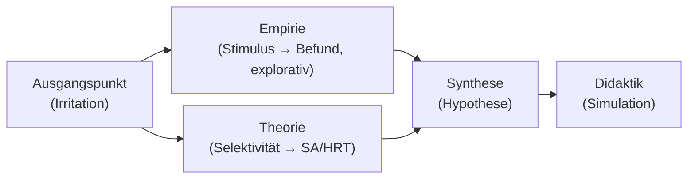

created: 20.2.2026 | [updated](https://github.com/jochen-hanisch/vortraege/): 20.2.2026 | [publishd](https://zenodo.org/records/):  | [Austausch](https://lernen.jochen-hanisch.de/course/view.php?id=4) | [[Hinweise]]

**Wahrnehmung von männlichen und weiblichen Auszubildenden im Umgang mit pädiatrischen Patient:innen**

*Was Eye-Tracking über selektive Aufmerksamkeit zeigt (explorativ)*

---

Ringvorlesung Rettungswissenschaften am **27.05.2026**

Vielen Dank für die Einladung:
- [HSD Hochschule Döpfer GmbH](https://www.hs-doepfer.de/events/ringvorlesung-rettungswissenschaften-2026)
- [Fliedner Fachhochschule gGmbH](https://www.fliedner-fachhochschule.de/offene-ringvorlesung-rettungswissenschaft/)

[[Wissenschaftler|Jochen Hanisch, M.A., M.A.]]

---

**Vortragspfad**

---
![[Professionelle Praxis/Fliedner Fachhochschule Düsseldorf/Ringvorlesungen/Wahrnehmung/F3-S3.png]]
---

**Kontext (Wie kam es dazu?)**

- Dissertationskontext: digitaler Bildungsraum / Simulation
- Methode: Eye-Tracking als Externalisierung („Beobachtung von Beobachtung“)
- Stimulus: pädiatrische Gewaltsituation (hoch aktivierend)
- Nebenbefund: erst im schnellen Bildwechsel sichtbar geworden (Serendipität)

---

**Methodische Transparenz**

> [!warning] Explorativ, nicht kausal
> Eye-Tracking misst visuelle Aufmerksamkeit (Proxy), nicht Empathie/Intention/„Moral“.

- Stichprobe: pro Ausbildungsjahr  (1.–3. Jahr) $n=3$ je weiblich & männlich
- Darstellung: aggregierte Visualisierungen (deskriptiv)
- Keine a-priori-Hypothese „Geschlecht“ (Nebenbefund)
- Konsequenz: Hypothesengenerator, nicht Effekt-Nachweis

---

![[Professionelle Praxis/Fliedner Fachhochschule Düsseldorf/Ringvorlesungen/Wahrnehmung/F3-S3_Fog-View_Gesamt_Weiblich.png]]

---

![[Professionelle Praxis/Fliedner Fachhochschule Düsseldorf/Ringvorlesungen/Wahrnehmung/F3-S3_Fog-View_Gesamt_Männlich.png]]

---

![[Professionelle Praxis/Fliedner Fachhochschule Düsseldorf/Ringvorlesungen/Wahrnehmung/F3-S3_Heatmap_Gesamt_Weiblich.png]]

---

![[Professionelle Praxis/Fliedner Fachhochschule Düsseldorf/Ringvorlesungen/Wahrnehmung/F3-S3_Heatmap_Gesamt_Männlich.png]]

---

![[Professionelle Praxis/Fliedner Fachhochschule Düsseldorf/Ringvorlesungen/Wahrnehmung/F3-S3_View-Map_Gesamt_Weiblich.png]]

---

![[Professionelle Praxis/Fliedner Fachhochschule Düsseldorf/Ringvorlesungen/Wahrnehmung/F3-S3_View-Map_Gesamt_Männlich.png]]

---

**Was lässt sich (nicht) sagen?**

Beobachtung (sicher):
- Unterschiedliche Verteilungen der visuellen Fixationen (aggregiert)

Nicht zulässig (ohne Überdehnung):
- Kompetenz-, Empathie- oder Motivzuschreibungen
- Kausalbehauptungen („weil Geschlecht …“)
- Generalisierung über Setting/Stimulus hinaus

---

**Thesen & Gegenthesen**

**These A (deskriptiv):** Gruppen zeigen unterschiedliche Aufmerksamkeitsfokusse.  
**These B (Lesart):** Fokus Gesicht → patientennahe Cues.  
**These C (Lesart):** Fokus Umgebung → Kontext-/Gefahren-Cues.

**Gegenthesen (methodisch):**

- sehr kleine Stichprobe / Aggregationsartefakte
- stimulus-spezifisch, nicht generalisierbar
- individuelle Varianz vermutlich größer als Gruppendifferenz

---

**Mögliche Lesarten**

1. Sozialisation / Rollenbilder (Erwartungen lenken Aufmerksamkeit)
2. Stressverarbeitung (Fokus verengt oder weitet sich)
3. Professionelle Schemata im Aufbau (Ausbildungsjahr, Vorerfahrung)
4. Universelle Wahrnehmungs-Biases (Selektivität als Normalfall)

---

**Weshalb ist das relevant?**

(High-Responsibility-Teams)

- Teamleistung hängt an geteilter Situational Awareness
- Wenn Wahrnehmung *vor* Interpretation schon divergiert:
  - entstehen komplementäre Stärken *oder*
  - komplementäre blinde Flecken
- Kernfrage für Ausbildung/Praxis: Wie machen wir Wahrnehmungsfokus besprechbar?

---

**Didaktische Konsequenzen**

- Simulation + strukturiertes Debriefing: „Was habe ich nicht gesehen?“
- Eye-Tracking als Feedback *für Reflexion*, nicht für Bewertung
- Perspektivwechsel-Übungen (Teamrollen, Aufgabenfokus)
- Teamkommunikation trainieren: „Ich sehe … / mir fehlt …“

---

**Soziotechnische Pointe**

> [!info] Technik eliminiert blinde Flecken nicht – sie verschiebt sie.

- Externalisierung macht Selektivität sichtbar (epistemisch)
- Technik kann kompensieren, aber auch neue Biases erzeugen (Overreliance)
- Schlussfolgerung: nicht „mehr Technik“, sondern *reflexive Integration*

---

**Kernaussagen**

1. Wahrnehmung in Hochrisikosituationen ist selektiv.
2. Selektivität bleibt ohne Externalisierung oft unsichtbar – selbst für Profis.
3. Eye-Tracking zeigt *deskriptive Muster* (kein Beweis für Ursachen).
4. Unterschiede können im Team Ressource *oder* blinder Fleck sein.
5. Professionalisierung beginnt mit Sichtbarmachung + Reflexion (Debriefing).

---

**Schlussfolie**

1. Pädiatrische Hochrisikosituationen aktivieren selektive Wahrnehmung.
2. Eye-Tracking macht diese Selektivität sichtbar.
3. In unseren Daten zeigt sich ein exploratives, aggregiertes Gruppenmuster.
4. Das ist kein Kausalbeleg und kein Urteil über Kompetenz.
5. Der Wert liegt in der Irritation: Wir übersehen die eigene Selektivität.
6. Teams brauchen integrierte Perspektiven, nicht Gleichförmigkeit.
7. Ausbildung kann das mit Simulation + Debriefing systematisch bearbeiten.

---

**Diskussion**

- Was würden Sie bei sich selbst als „typischen Wahrnehmungsfokus“ vermuten?
- Welche blinden Flecken entstehen in Teams *systematisch*?
- Wie könnte ein Debriefing aussehen, das Wahrnehmung (nicht Moral) reflektiert?
- Wo hilft Technik – und wo verschiebt sie nur das Problem?

---

**Literatur**

- Endsley, M. R. (1995). Toward a theory of situation awareness in dynamic systems. *Human Factors*.
- Holmqvist, K., et al. (2011). *Eye tracking: A comprehensive guide to methods and measures*.
- Duchowski, A. T. (2017). *Eye tracking methodology*.
- Hyde, J. S. (2014). Gender similarities and differences. *Annual Review of Psychology*.
- Woods, D. D. (2017). The theory of graceful extensibility. In *Resilience Engineering*.
