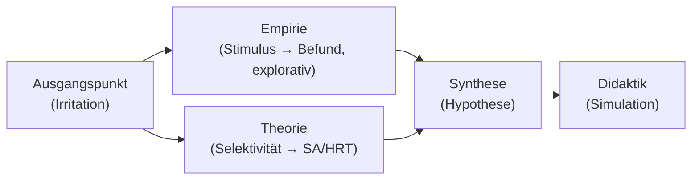

created: 20.2.2026 | [updated](https://github.com/jochen-hanisch/vortraege/): 20.2.2026 | [publishd](https://zenodo.org/records/):  | [Austausch](https://lernen.jochen-hanisch.de/course/view.php?id=4) | [[Hinweise]]

**Wahrnehmung von männlichen und weiblichen Auszubildenden im Umgang mit pädiatrischen Patient:innen**  [^21]

*Eye-Tracking und selektive Aufmerksamkeit (explorativ).*  [^10] [^4]

---

Ringvorlesung Rettungswissenschaften, **27.05.2026**.  [^9] [^7]

Veranstalter:  [^9] [^7]
- [HSD Hochschule Döpfer GmbH](https://www.hs-doepfer.de/events/ringvorlesung-rettungswissenschaften-2026)  [^9]
- [Fliedner Fachhochschule gGmbH](https://www.fliedner-fachhochschule.de/offene-ringvorlesung-rettungswissenschaft/)  [^7]

[[Wissenschaftler|Jochen Hanisch, M.A., M.A.]]  [^21]

---

**Vortragspfad**  [^5] [^20]

SA = Situational Awareness.  [^5]  
HRT/HRO = High-Responsibility-/High-Reliability-Teams/Organisationen.  [^20]

---

![[Professionelle Praxis/Fliedner Fachhochschule Düsseldorf/Ringvorlesungen/Wahrnehmung/F3-S3.png]]

Quelle: eigenes Datenmaterial.  [^21]

---

**Kontext (Wie kam es dazu?)**  [^21]

- Dissertationskontext: digitaler Bildungsraum / Simulation.  [^21]
- Eye-Tracking als Externalisierung („Beobachtung von Beobachtung“).  [^4] [^13]
- Pädiatrische Notfallsituationen als hoch aktivierender Kontext.  [^1]
- Exploratives „Nebenprodukt“/Serendipität als Erkenntnismoment.  [^14]

---

**Methodische Transparenz**  [^19] [^17]

- Explorativ, nicht kausal.  [^19] [^17]
- Eye-Tracking misst visuelle Aufmerksamkeit (Proxy), nicht Empathie/Intention/„Moral“.  [^10] [^4]
- Stichprobe: pro Ausbildungsjahr (1.–3. Jahr) `n=3` je weiblich & männlich.  [^21]
- Darstellung: aggregierte Visualisierungen (deskriptiv).  [^10]
- Konsequenz: Hypothesengenerator, nicht Effekt-Nachweis.  [^19] [^17]

---

![[Professionelle Praxis/Fliedner Fachhochschule Düsseldorf/Ringvorlesungen/Wahrnehmung/F3-S3_Fog-View_Gesamt_Weiblich.png]]

Quelle: eigenes Datenmaterial.  [^21]

---

![[Professionelle Praxis/Fliedner Fachhochschule Düsseldorf/Ringvorlesungen/Wahrnehmung/F3-S3_Fog-View_Gesamt_Männlich.png]]

Quelle: eigenes Datenmaterial.  [^21]

---

![[Professionelle Praxis/Fliedner Fachhochschule Düsseldorf/Ringvorlesungen/Wahrnehmung/F3-S3_Heatmap_Gesamt_Weiblich.png]]

Quelle: eigenes Datenmaterial.  [^21]

---

![[Professionelle Praxis/Fliedner Fachhochschule Düsseldorf/Ringvorlesungen/Wahrnehmung/F3-S3_Heatmap_Gesamt_Männlich.png]]

Quelle: eigenes Datenmaterial.  [^21]

---

![[Professionelle Praxis/Fliedner Fachhochschule Düsseldorf/Ringvorlesungen/Wahrnehmung/F3-S3_View-Map_Gesamt_Weiblich.png]]

Quelle: eigenes Datenmaterial.  [^21]

---

![[Professionelle Praxis/Fliedner Fachhochschule Düsseldorf/Ringvorlesungen/Wahrnehmung/F3-S3_View-Map_Gesamt_Männlich.png]]

Quelle: eigenes Datenmaterial.  [^21]

---

**Was lässt sich (nicht) sagen?**  [^10] [^4] [^17]

- Beobachtung: Fixations-/Aufmerksamkeitsverteilungen unterscheiden sich (aggregiert).  [^10] [^4]
- Nicht zulässig: Kompetenz-, Empathie- oder Motivzuschreibungen.  [^10] [^4]
- Nicht zulässig: Kausalbehauptungen („weil Geschlecht …“).  [^17]
- Nicht zulässig: Generalisierung über Setting/Stimulus hinaus.  [^17]

---

**Thesen & Gegenthesen**  [^10] [^4] [^5] [^3] [^8] [^11]

- These A (deskriptiv): Gruppen zeigen unterschiedliche Aufmerksamkeitsfokusse.  [^10] [^4]
- These B (Lesart): Fokus Gesicht → patientennahe Cues.  [^5]
- These C (Lesart): Fokus Umgebung → Kontext-/Gefahren-Cues.  [^5]
- Gegenthese: sehr kleine Stichprobe / Aggregationsartefakte.  [^3] [^8]
- Gegenthese: stimulus-spezifisch, nicht generalisierbar.  [^17]
- Gegenthese: individuelle Varianz oft größer als Gruppendifferenz.  [^11]

---

**Mögliche Lesarten**  [^11] [^18] [^12]

1. Kontextfaktoren & Sozialisation (Erwartungen lenken Aufmerksamkeit).  [^11]
2. Stressverarbeitung (Fokus verengt oder weitet sich).  [^18]
3. Wahrnehmungs- & Entscheidungsheuristiken (Biases als Normalfall).  [^12]

---

**Weshalb ist das relevant? (High-Responsibility-Teams)**  [^5] [^16] [^20] [^6]

- Teamleistung hängt an geteilter Situational Awareness.  [^5] [^16]
- Divergenz in Wahrnehmung kann komplementäre Stärken *oder* blinde Flecken erzeugen.  [^20]
- Konsequenz: Wahrnehmungsfokus muss im Team kommunizierbar werden.  [^16] [^6]

---

**Didaktische Konsequenzen**  [^6] [^10] [^4] [^16]

- Simulation + strukturiertes Debriefing: „Was habe ich nicht gesehen?“.  [^6]
- Eye-Tracking als Feedback für Reflexion, nicht für Bewertung.  [^10] [^4]
- Teamtraining: Perspektivwechsel + Kommunikationsroutinen.  [^16]

---

**Soziotechnische Pointe**  [^2] [^15] [^20]

- Technik verschiebt blinde Flecken (statt sie zu eliminieren).  [^2]
- Automation/Monitoring kann Overreliance/Automation Bias fördern.  [^15] [^2]
- Schlussfolgerung: reflexive Integration statt Technik-Maximierung.  [^20] [^15]

---

**Kernaussagen**  [^5] [^12] [^4] [^13] [^10] [^17] [^20] [^16] [^6]

1. Wahrnehmung in Hochrisikosituationen ist selektiv.  [^5] [^12]
2. Selektivität wird durch Externalisierung (z. B. Eye-Tracking) sichtbar.  [^4] [^13]
3. Eye-Tracking zeigt deskriptive Muster, keine Ursachen.  [^10] [^17]
4. Unterschiede können im Team Ressource oder blinder Fleck sein.  [^20] [^16]
5. Professionalisierung beginnt mit Sichtbarmachung + Reflexion (Debriefing).  [^6]

---

**Schlussfolie**  [^1] [^5] [^10] [^4] [^21] [^19] [^17] [^20] [^16] [^6]

1. Hochrisikosituationen aktivieren selektive Wahrnehmung.  [^1] [^5]
2. Eye-Tracking macht Selektivität sichtbar.  [^10] [^4]
3. Hier: exploratives, aggregiertes Muster in eigenen Daten.  [^21] [^19]
4. Kein Kausalbeleg, kein Kompetenzurteil.  [^17] [^10]
5. Teams brauchen integrierte Perspektiven, nicht Gleichförmigkeit.  [^20] [^16]
6. Ausbildung kann das mit Simulation + Debriefing bearbeiten.  [^6] [^16]

---

**Diskussion**  [^12] [^20] [^6] [^2] [^15]

- Woran merke ich meinen typischen Wahrnehmungsfokus?  [^12]
- Welche blinden Flecken entstehen im Team systematisch?  [^20]
- Wie würde ein Debriefing aussehen, das Wahrnehmung (nicht Moral) reflektiert?  [^6]
- Wo hilft Technik – und wo verschiebt sie das Problem?  [^2] [^15]

---

**Fußnoten / Literatur (APA 7)**

 [^1]: Abelsson, A., & Nygårdh, A. (2019). To enhance the quality of paediatric emergency care: Nurses’ experiences. *Journal of Clinical Nursing, 28*(7–8), 1259–1267.

 [^2]: Bainbridge, L. (1983). Ironies of automation. *Automatica, 19*(6), 775–779.

 [^3]: Button, K. S., Ioannidis, J. P. A., Mokrysz, C., Nosek, B. A., Flint, J., Robinson, E. S. J., & Munafò, M. R. (2013). Power failure: Why small sample size undermines the reliability of neuroscience. *Nature Reviews Neuroscience, 14*(5), 365–376.

 [^4]: Duchowski, A. T. (2017). *Eye tracking methodology: Theory and practice* (3rd ed.). Springer.

 [^5]: Endsley, M. R. (1995). Toward a theory of situation awareness in dynamic systems. *Human Factors, 37*(1), 32–64.

 [^6]: Fanning, R. M., & Gaba, D. M. (2007). The role of debriefing in simulation-based learning. *Simulation in Healthcare, 2*(2), 115–125.

 [^7]: Fliedner Fachhochschule. (2026). Offene Ringvorlesung Rettungswissenschaft. *Webseite*. https://www.fliedner-fachhochschule.de/offene-ringvorlesung-rettungswissenschaft/

 [^8]: Gelman, A., & Loken, E. (2014). The statistical crisis in science. *American Scientist, 102*(6), 460.

 [^9]: HSD Hochschule Döpfer GmbH. (2026). Ringvorlesung Rettungswissenschaften 2026. *Webseite*. https://www.hs-doepfer.de/events/ringvorlesung-rettungswissenschaften-2026

 [^10]: Holmqvist, K., Nyström, M., Andersson, R., Dewhurst, R., Jarodzka, H., & van de Weijer, J. (2011). *Eye tracking: A comprehensive guide to methods and measures*. Oxford University Press.

 [^11]: Hyde, J. S. (2014). Gender similarities and differences. *Annual Review of Psychology, 65*, 373–398.

 [^12]: Kahneman, D. (2011). *Thinking, fast and slow*. Farrar, Straus and Giroux.

 [^13]: Luhmann, N. (1995). *Social systems*. Stanford University Press.

 [^14]: Merton, R. K., & Barber, E. (2004). *The travels and adventures of serendipity: A study in sociological semantics and the sociology of science*. Princeton University Press.

 [^15]: Parasuraman, R., & Riley, V. (1997). Humans and automation: Use, misuse, disuse, abuse. *Human Factors, 39*(2), 230–253.

 [^16]: Salas, E., DiazGranados, D., Klein, C., Burke, C. S., Stagl, K. C., Goodwin, G. F., & Halpin, S. M. (2008). Does team training work? Principles for health care. *Academic Medicine, 83*(4), 354–361.

 [^17]: Shadish, W. R., Cook, T. D., & Campbell, D. T. (2002). *Experimental and quasi-experimental designs for generalized causal inference*. Houghton Mifflin.

 [^18]: Taylor, S. E., Klein, L. C., Lewis, B. P., Gruenewald, T. L., Gurung, R. A. R., & Updegraff, J. A. (2000). Biobehavioral responses to stress in females: Tend-and-befriend, not fight-or-flight. *Psychological Review, 107*(3), 411–429.

 [^19]: Tukey, J. W. (1977). *Exploratory data analysis*. Addison-Wesley.

 [^20]: Weick, K. E., & Sutcliffe, K. M. (2015). *Managing the unexpected: Sustained performance in a complex world* (3rd ed.). Wiley.

 [^21]: Hanisch, J. (2026). Eye-Tracking in der pädiatrischen Simulationausbildung: Rohdaten & aggregierte Visualisierungen (unveröffentlichtes Datenmaterial).
