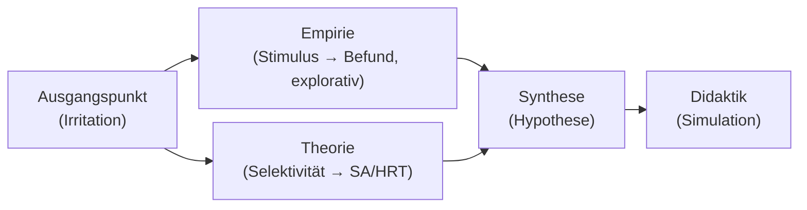

created: 20.2.2026 | [updated](https://github.com/jochen-hanisch/vortraege/): 20.2.2026 | [publishd](https://zenodo.org/records/):  | [Austausch](https://lernen.jochen-hanisch.de/course/view.php?id=4) | [[Hinweise]]

**Wahrnehmung von männlichen und weiblichen Auszubildenden im Umgang mit pädiatrischen Patient:innen** (Hanisch, 2026)

*Eye-Tracking und selektive Aufmerksamkeit (explorativ).* (Duchowski, 2017; Holmqvist et al., 2011)

---

Ringvorlesung Rettungswissenschaften, **27.05.2026**. (Fliedner Fachhochschule, 2026; HSD Hochschule Döpfer GmbH, 2026)

Veranstalter: (Fliedner Fachhochschule, 2026; HSD Hochschule Döpfer GmbH, 2026)
- [HSD Hochschule Döpfer GmbH](https://www.hs-doepfer.de/events/ringvorlesung-rettungswissenschaften-2026) (HSD Hochschule Döpfer GmbH, 2026)
- [Fliedner Fachhochschule gGmbH](https://www.fliedner-fachhochschule.de/offene-ringvorlesung-rettungswissenschaft/) (Fliedner Fachhochschule, 2026)

[[Wissenschaftler|Jochen Hanisch, M.A., M.A.]] (Hanisch, 2026)

---

**Vortragspfad** (Endsley, 1995; Weick & Sutcliffe, 2015)

```mermaid
%%{init: {"flowchart": {"nodeSpacing": 14, "rankSpacing": 22}} }%%
flowchart LR
  A0["Ausgangspunkt<br>(Irritation)"] --> E["Empirie<br>(Stimulus → Befund, explorativ)"]
  A0 --> T["Theorie<br>(Selektivität → SA/HRT)"]
  E --> S["Synthese<br>(Hypothese)"] --> D["Didaktik<br>(Simulation)"]
  T --> S
```

SA = Situational Awareness. (Endsley, 1995)  
HRT/HRO = High-Responsibility-/High-Reliability-Teams/Organisationen. (Weick & Sutcliffe, 2015)

%%
Blueprint / Moderation (für Notizen, nicht auf Folie)

Zusage / Rahmung (aus GPT-Austausch):
- Fokus: Wahrnehmung, Selektivität, SA, High-Responsibility-Teams
- „Geschlecht“: Gruppierungsvariable im Material, nicht Ziel einer Debatte
- Befund: explorativer Nebenbefund (Serendipität) → epistemische Entdeckung durch Externalisierung

Zielbild (60 + 30):
- 60 Minuten: gemeinsames „Sehen lernen“ (Erfahrung → Befund → Einordnung → Konsequenzen)
- 30 Minuten: Diskussion/Transfer (Ausbildung, Teamkommunikation, Debriefing)

Zeitvorschlag:
- 0–5: Begrüßung + Rahmung + Erwartungsmanagement (explorativ, klein n, keine Kausalität)
- 5–15: Einstieg mit Stimulus (ohne Heatmap/Fog), Fragen an den Raum, Stichworte sammeln
- 15–25: Kontext (Dissertation, Eye-Tracking, digitaler Lernraum, Serendipität) + Methodik (was misst ET / was nicht)
- 25–40: Befundbilder zeigen (Fog → Heat → View), jeweils kurz Stille + Vergleich; Drehpunkt: „erst im Wechsel aufgefallen“
- 40–50: Thesen/Gegenthesen + Lesarten (als Angebote); Brücke: Selektivität → SA (Perception als Grundlage)
- 50–60: Relevanz HRT (komplementäre Stärken vs. blinde Flecken) + Didaktik (Simulation + Debriefing)

Moderationskarten:
- „Gender“-Fokus: „Gruppierungsvariable; Erkenntniswert ist Selektivität + Team-Implikationen.“
- „Beweis/Statistik“: „Explorativ; Hypothesengenerator, kein Effekt-Nachweis.“
- Moralische Zuschreibung: „ET zeigt Aufmerksamkeit als Proxy, nicht Intention/Moral.“
%%

---

![[Professionelle Praxis/Fliedner Fachhochschule Düsseldorf/Ringvorlesungen/Wahrnehmung/F3-S3.png]]

Quelle: Datensatz (Zenodo, DOI: 10.5281/zenodo.18776839). (Hanisch, 2026)

---

**Kontext (Wie kam es dazu?)** (Hanisch, 2026)

- Dissertationskontext: digitaler Bildungsraum / Simulation. (Hanisch, 2026)
- Eye-Tracking als Externalisierung („Beobachtung von Beobachtung“). (Duchowski, 2017; Luhmann, 1995)
- Pädiatrische Notfallsituationen als hoch aktivierender Kontext. (Abelsson & Nygårdh, 2019)
- Exploratives „Nebenprodukt“/Serendipität als Erkenntnismoment. (Merton & Barber, 2004)

---

**Methodische Transparenz** (Shadish et al., 2002; Tukey, 1977)

- Explorativ, nicht kausal. (Shadish et al., 2002; Tukey, 1977)
- Eye-Tracking misst visuelle Aufmerksamkeit (Proxy), nicht Empathie/Intention/„Moral“. (Duchowski, 2017; Holmqvist et al., 2011)
- Stichprobe: pro Ausbildungsjahr (1.–3. Jahr) `n=3` je weiblich & männlich. (Hanisch, 2026)
- Darstellung: aggregierte Visualisierungen (deskriptiv). (Holmqvist et al., 2011)
- Konsequenz: Hypothesengenerator, nicht Effekt-Nachweis. (Shadish et al., 2002; Tukey, 1977)

---

![[Professionelle Praxis/Fliedner Fachhochschule Düsseldorf/Ringvorlesungen/Wahrnehmung/F3-S3_Fog-View_Gesamt_Weiblich.png]]

Quelle: Datensatz (Zenodo, DOI: 10.5281/zenodo.18776839). (Hanisch, 2026)

---

![[Professionelle Praxis/Fliedner Fachhochschule Düsseldorf/Ringvorlesungen/Wahrnehmung/F3-S3_Fog-View_Gesamt_Männlich.png]]

Quelle: Datensatz (Zenodo, DOI: 10.5281/zenodo.18776839). (Hanisch, 2026)

---

![[Professionelle Praxis/Fliedner Fachhochschule Düsseldorf/Ringvorlesungen/Wahrnehmung/F3-S3_Heatmap_Gesamt_Weiblich.png]]

Quelle: Datensatz (Zenodo, DOI: 10.5281/zenodo.18776839). (Hanisch, 2026)

---

![[Professionelle Praxis/Fliedner Fachhochschule Düsseldorf/Ringvorlesungen/Wahrnehmung/F3-S3_Heatmap_Gesamt_Männlich.png]]

Quelle: Datensatz (Zenodo, DOI: 10.5281/zenodo.18776839). (Hanisch, 2026)

---

![[Professionelle Praxis/Fliedner Fachhochschule Düsseldorf/Ringvorlesungen/Wahrnehmung/F3-S3_View-Map_Gesamt_Weiblich.png]]

Quelle: Datensatz (Zenodo, DOI: 10.5281/zenodo.18776839). (Hanisch, 2026)

---

![[Professionelle Praxis/Fliedner Fachhochschule Düsseldorf/Ringvorlesungen/Wahrnehmung/F3-S3_View-Map_Gesamt_Männlich.png]]

Quelle: Datensatz (Zenodo, DOI: 10.5281/zenodo.18776839). (Hanisch, 2026)

---

**Was lässt sich (nicht) sagen?** (Duchowski, 2017; Holmqvist et al., 2011; Shadish et al., 2002)

- Beobachtung: Fixations-/Aufmerksamkeitsverteilungen unterscheiden sich (aggregiert). (Duchowski, 2017; Holmqvist et al., 2011)
- Nicht zulässig: Kompetenz-, Empathie- oder Motivzuschreibungen. (Duchowski, 2017; Holmqvist et al., 2011)
- Nicht zulässig: Kausalbehauptungen („weil Geschlecht …“). (Shadish et al., 2002)
- Nicht zulässig: Generalisierung über Setting/Stimulus hinaus. (Shadish et al., 2002)

---

**Thesen & Gegenthesen** (Button et al., 2013; Duchowski, 2017; Endsley, 1995; Gelman & Loken, 2014; Holmqvist et al., 2011; Hyde, 2014)

- These A (deskriptiv): Gruppen zeigen unterschiedliche Aufmerksamkeitsfokusse. (Duchowski, 2017; Holmqvist et al., 2011)
- These B (Lesart): Fokus Gesicht → patientennahe Cues. (Endsley, 1995)
- These C (Lesart): Fokus Umgebung → Kontext-/Gefahren-Cues. (Endsley, 1995)
- Gegenthese: sehr kleine Stichprobe / Aggregationsartefakte. (Button et al., 2013; Gelman & Loken, 2014)
- Gegenthese: stimulus-spezifisch, nicht generalisierbar. (Shadish et al., 2002)
- Gegenthese: individuelle Varianz oft größer als Gruppendifferenz. (Hyde, 2014)

---

**Mögliche Lesarten** (Hyde, 2014; Kahneman, 2011; Taylor et al., 2000)

1. Kontextfaktoren & Sozialisation (Erwartungen lenken Aufmerksamkeit). (Hyde, 2014)
2. Stressverarbeitung (Fokus verengt oder weitet sich). (Taylor et al., 2000)
3. Wahrnehmungs- & Entscheidungsheuristiken (Biases als Normalfall). (Kahneman, 2011)

---

**Weshalb ist das relevant? (High-Responsibility-Teams)** (Endsley, 1995; Fanning & Gaba, 2007; Salas et al., 2008; Weick & Sutcliffe, 2015)

- Teamleistung hängt an geteilter Situational Awareness. (Endsley, 1995; Salas et al., 2008)
- Divergenz in Wahrnehmung kann komplementäre Stärken *oder* blinde Flecken erzeugen. (Weick & Sutcliffe, 2015)
- Konsequenz: Wahrnehmungsfokus muss im Team kommunizierbar werden. (Fanning & Gaba, 2007; Salas et al., 2008)

---

**Didaktische Konsequenzen** (Duchowski, 2017; Fanning & Gaba, 2007; Holmqvist et al., 2011; Salas et al., 2008)

- Simulation + strukturiertes Debriefing: „Was habe ich nicht gesehen?“. (Fanning & Gaba, 2007)
- Eye-Tracking als Feedback für Reflexion, nicht für Bewertung. (Duchowski, 2017; Holmqvist et al., 2011)
- Teamtraining: Perspektivwechsel + Kommunikationsroutinen. (Salas et al., 2008)

---

**Soziotechnische Pointe** (Bainbridge, 1983; Parasuraman & Riley, 1997; Weick & Sutcliffe, 2015)

- Technik verschiebt blinde Flecken (statt sie zu eliminieren). (Bainbridge, 1983)
- Automation/Monitoring kann Overreliance/Automation Bias fördern. (Bainbridge, 1983; Parasuraman & Riley, 1997)
- Schlussfolgerung: reflexive Integration statt Technik-Maximierung. (Parasuraman & Riley, 1997; Weick & Sutcliffe, 2015)

---

**Kernaussagen** (Duchowski, 2017; Endsley, 1995; Fanning & Gaba, 2007; Holmqvist et al., 2011; Kahneman, 2011; Luhmann, 1995; Salas et al., 2008; Shadish et al., 2002; Weick & Sutcliffe, 2015)

1. Wahrnehmung in Hochrisikosituationen ist selektiv. (Endsley, 1995; Kahneman, 2011)
2. Selektivität wird durch Externalisierung (z. B. Eye-Tracking) sichtbar. (Duchowski, 2017; Luhmann, 1995)
3. Eye-Tracking zeigt deskriptive Muster, keine Ursachen. (Holmqvist et al., 2011; Shadish et al., 2002)
4. Unterschiede können im Team Ressource oder blinder Fleck sein. (Salas et al., 2008; Weick & Sutcliffe, 2015)
5. Professionalisierung beginnt mit Sichtbarmachung + Reflexion (Debriefing). (Fanning & Gaba, 2007)

---

**Schlussfolie** (Abelsson & Nygårdh, 2019; Duchowski, 2017; Endsley, 1995; Fanning & Gaba, 2007; Hanisch, 2026; Holmqvist et al., 2011; Salas et al., 2008; Shadish et al., 2002; Tukey, 1977; Weick & Sutcliffe, 2015)

1. Hochrisikosituationen aktivieren selektive Wahrnehmung. (Abelsson & Nygårdh, 2019; Endsley, 1995)
2. Eye-Tracking macht Selektivität sichtbar. (Duchowski, 2017; Holmqvist et al., 2011)
3. Hier: exploratives, aggregiertes Muster in eigenen Daten. (Hanisch, 2026; Tukey, 1977)
4. Kein Kausalbeleg, kein Kompetenzurteil. (Holmqvist et al., 2011; Shadish et al., 2002)
5. Teams brauchen integrierte Perspektiven, nicht Gleichförmigkeit. (Salas et al., 2008; Weick & Sutcliffe, 2015)
6. Ausbildung kann das mit Simulation + Debriefing bearbeiten. (Fanning & Gaba, 2007; Salas et al., 2008)

---

**Diskussion** (Bainbridge, 1983; Fanning & Gaba, 2007; Kahneman, 2011; Parasuraman & Riley, 1997; Weick & Sutcliffe, 2015)

- Woran merke ich meinen typischen Wahrnehmungsfokus? (Kahneman, 2011)
- Welche blinden Flecken entstehen im Team systematisch? (Weick & Sutcliffe, 2015)
- Wie würde ein Debriefing aussehen, das Wahrnehmung (nicht Moral) reflektiert? (Fanning & Gaba, 2007)
- Wo hilft Technik – und wo verschiebt sie das Problem? (Bainbridge, 1983; Parasuraman & Riley, 1997)

---

**Literatur (APA 7)**

- Abelsson, A., & Nygårdh, A. (2019). To enhance the quality of paediatric emergency care: Nurses’ experiences. *Journal of Clinical Nursing, 28*(7–8), 1259–1267.
- Bainbridge, L. (1983). Ironies of automation. *Automatica, 19*(6), 775–779.
- Button, K. S., Ioannidis, J. P. A., Mokrysz, C., Nosek, B. A., Flint, J., Robinson, E. S. J., & Munafò, M. R. (2013). Power failure: Why small sample size undermines the reliability of neuroscience. *Nature Reviews Neuroscience, 14*(5), 365–376.
- Duchowski, A. T. (2017). *Eye tracking methodology: Theory and practice* (3rd ed.). Springer.
- Endsley, M. R. (1995). Toward a theory of situation awareness in dynamic systems. *Human Factors, 37*(1), 32–64.
- Fanning, R. M., & Gaba, D. M. (2007). The role of debriefing in simulation-based learning. *Simulation in Healthcare, 2*(2), 115–125.
- Fliedner Fachhochschule. (2026). Offene Ringvorlesung Rettungswissenschaft. *Webseite*. https://www.fliedner-fachhochschule.de/offene-ringvorlesung-rettungswissenschaft/
- Gelman, A., & Loken, E. (2014). The statistical crisis in science. *American Scientist, 102*(6), 460.
- Hanisch, J. (2026). *Eye-Tracking in der pädiatrischen Simulationausbildung: Rohdaten & aggregierte Visualisierungen* (Version 1) [Data set]. Zenodo. https://doi.org/10.5281/zenodo.18776839
- Holmqvist, K., Nyström, M., Andersson, R., Dewhurst, R., Jarodzka, H., & van de Weijer, J. (2011). *Eye tracking: A comprehensive guide to methods and measures*. Oxford University Press.
- HSD Hochschule Döpfer GmbH. (2026). Ringvorlesung Rettungswissenschaften 2026. *Webseite*. https://www.hs-doepfer.de/events/ringvorlesung-rettungswissenschaften-2026
- Hyde, J. S. (2014). Gender similarities and differences. *Annual Review of Psychology, 65*, 373–398.
- Kahneman, D. (2011). *Thinking, fast and slow*. Farrar, Straus and Giroux.
- Luhmann, N. (1995). *Social systems*. Stanford University Press.
- Merton, R. K., & Barber, E. (2004). *The travels and adventures of serendipity: A study in sociological semantics and the sociology of science*. Princeton University Press.
- Parasuraman, R., & Riley, V. (1997). Humans and automation: Use, misuse, disuse, abuse. *Human Factors, 39*(2), 230–253.
- Salas, E., DiazGranados, D., Klein, C., Burke, C. S., Stagl, K. C., Goodwin, G. F., & Halpin, S. M. (2008). Does team training work? Principles for health care. *Academic Medicine, 83*(4), 354–361.
- Shadish, W. R., Cook, T. D., & Campbell, D. T. (2002). *Experimental and quasi-experimental designs for generalized causal inference*. Houghton Mifflin.
- Taylor, S. E., Klein, L. C., Lewis, B. P., Gruenewald, T. L., Gurung, R. A. R., & Updegraff, J. A. (2000). Biobehavioral responses to stress in females: Tend-and-befriend, not fight-or-flight. *Psychological Review, 107*(3), 411–429.
- Tukey, J. W. (1977). *Exploratory data analysis*. Addison-Wesley.
- Weick, K. E., & Sutcliffe, K. M. (2015). *Managing the unexpected: Sustained performance in a complex world* (3rd ed.). Wiley.
