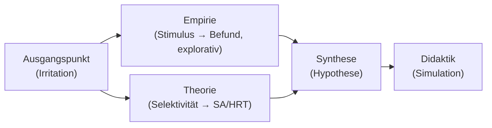

**Wahrnehmung von männlichen und weiblichen Auszubildenden im Umgang mit pädiatrischen Patient:innen** (Hanisch, 2026)

*Eye-Tracking und selektive Aufmerksamkeit (explorativ).* (Duchowski, 2017; Holmqvist et al., 2011)

Ringvorlesung Rettungswissenschaften, **27.05.2026**. (Fliedner Fachhochschule, 2026; HSD Hochschule Döpfer GmbH, 2026)

[[Wissenschaftler|Jochen Hanisch, M.A., M.A.]] (Hanisch, 2026)

%%
Notizen (PPT):
- Zielrahmung: Wahrnehmung/Selektivität + Implikationen für High-Responsibility-Teams; „Geschlecht“ nur als Gruppierungsvariable, nicht als Debatte.
%%

---

**Vortragspfad** (Endsley, 1995; Weick & Sutcliffe, 2015)

```mermaid
%%{init: {"flowchart": {"nodeSpacing": 14, "rankSpacing": 22}} }%%
flowchart LR
  A0["Ausgangspunkt<br>(Irritation)"] --> E["Empirie<br>(Stimulus → Befund, explorativ)"]
  A0 --> T["Theorie<br>(Selektivität → SA/HRT)"]
  E --> S["Synthese<br>(Hypothese)"] --> D["Didaktik<br>(Simulation)"]
  T --> S
```

SA = Situational Awareness. (Endsley, 1995)  
HRT/HRO = High-Responsibility-/High-Reliability-Teams/Organisationen. (Weick & Sutcliffe, 2015)

%%
Notizen (PPT) – Timing (60 + 30):
- 0–5: Rahmung + Erwartungsmanagement (explorativ, klein n, keine Kausalität).
- 5–15: Stimulus (ohne Overlay) + Fragen an den Raum.
- 15–25: Kontext/Methode.
- 25–40: Befundbilder (Fog → Heat → View) + Vergleich.
- 40–50: Thesen/Gegenthesen + Lesarten → Brücke zu SA/HRT.
- 50–60: Didaktik + Take-away.

Moderationskarten:
- „Gender“-Fokus: Gruppierungsvariable; Erkenntniswert ist Selektivität + Team-Implikation.
- „Beweis/Statistik“: explorativ; Hypothesengenerator, kein Effekt-Nachweis.
- Moralische Zuschreibung: Eye-Tracking zeigt Aufmerksamkeit (Proxy), nicht Intention/Moral. (Holmqvist et al., 2011; Duchowski, 2017)
%%

---

**Empirie (Stimulus → Befund)** (Holmqvist et al., 2011; Duchowski, 2017)

- Stimulus: pädiatrische Gewaltsituation als hoch aktivierender Kontext. (Abelsson & Nygårdh, 2019)
- Befund: aggregierte Visualisierungen (Fog/Heat/View) zeigen Aufmerksamkeitsverteilungen. (Holmqvist et al., 2011; Duchowski, 2017)
- Datenquelle: Datensatz (Zenodo, DOI: 10.5281/zenodo.18776839). (Hanisch, 2026)
- Methodische Grenzen: explorativ, nicht kausal; Hypothesengenerator. (Shadish et al., 2002; Tukey, 1977)
- Zusatzgrenze: kleine Stichproben erhöhen Unsicherheit/Artefaktrisiko. (Button et al., 2013; Gelman & Loken, 2014)

%%
Notizen (PPT) – Bilder, die du in PowerPoint einfügst (aus Zenodo-Datensatz 10.5281/zenodo.18776839):
- Stimulus: `F3-S3.png`
- Fog: `F3-S3_Fog-View_Gesamt_Weiblich.png`, `F3-S3_Fog-View_Gesamt_Männlich.png`
- Heat: `F3-S3_Heatmap_Gesamt_Weiblich.png`, `F3-S3_Heatmap_Gesamt_Männlich.png`
- View: `F3-S3_View-Map_Gesamt_Weiblich.png`, `F3-S3_View-Map_Gesamt_Männlich.png`

Quellenzeile für jede Abbildung in PPT:
„Quelle: Hanisch (2026), Zenodo, 10.5281/zenodo.18776839.“
%%

---

**Theorie → Synthese (Hypothese/Implikation)** (Endsley, 1995; Kahneman, 2011; Weick & Sutcliffe, 2015)

- Selektive Wahrnehmung ist der Normalfall menschlicher Informationsverarbeitung. (Kahneman, 2011)
- Situational Awareness beginnt mit Wahrnehmung/Perception. (Endsley, 1995)
- High-Responsibility-/High-Reliability-Kontexte benötigen integrierte Perspektiven und Kommunikationsroutinen. (Weick & Sutcliffe, 2015; Salas et al., 2008)
- Synthese: Externalisierung (Eye-Tracking) macht Selektivität sichtbar; Teams müssen Wahrnehmungsfokus explizit kommunizieren, um blinde Flecken zu reduzieren. (Duchowski, 2017; Luhmann, 1995; Salas et al., 2008)

%%
Notizen (PPT) – 1 Satz „diskursstabil“:
„Der relevante Befund ist nicht eine Aussage *über* Geschlecht, sondern die Sichtbarmachung selektiver Wahrnehmung – und was das für Teamarbeit in Hochrisikosituationen bedeutet.“
%%

---

**Didaktische Konsequenzen** (Fanning & Gaba, 2007; Salas et al., 2008)

- Simulation + strukturiertes Debriefing: „Was habe ich nicht gesehen?“ (Fanning & Gaba, 2007)
- Teamtraining: Shared SA, Kommunikation, Koordination. (Salas et al., 2008; Endsley, 1995)
- Soziotechnische Ergänzung: Technik kompensiert nicht „alles“, sie verschiebt Risiken (Automation Bias/Overreliance). (Bainbridge, 1983; Parasuraman & Riley, 1997)
- Take-away: Professionalisierung beginnt mit Sichtbarmachung + Reflexion, nicht mit Moralzuschreibung. (Fanning & Gaba, 2007; Holmqvist et al., 2011)

**Diskussion** (Kahneman, 2011; Weick & Sutcliffe, 2015)
- Wo liegt mein eigener Wahrnehmungsfokus?
- Welche blinden Flecken entstehen im Team systematisch?
- Wie müsste ein Debriefing aussehen, das Wahrnehmung (nicht Moral) reflektiert? (Fanning & Gaba, 2007)

%%
Notizen (PPT) – Schluss:
- Wiederholung der 5 Kernaussagen (kurz) + Übergang in Diskussion.
%%

---

**Anhang: Literatur (APA 7)**

- Abelsson, A., & Nygårdh, A. (2019). To enhance the quality of paediatric emergency care: Nurses’ experiences. *Journal of Clinical Nursing, 28*(7–8), 1259–1267.
- Bainbridge, L. (1983). Ironies of automation. *Automatica, 19*(6), 775–779.
- Button, K. S., Ioannidis, J. P. A., Mokrysz, C., Nosek, B. A., Flint, J., Robinson, E. S. J., & Munafò, M. R. (2013). Power failure: Why small sample size undermines the reliability of neuroscience. *Nature Reviews Neuroscience, 14*(5), 365–376.
- Duchowski, A. T. (2017). *Eye tracking methodology: Theory and practice* (3rd ed.). Springer.
- Endsley, M. R. (1995). Toward a theory of situation awareness in dynamic systems. *Human Factors, 37*(1), 32–64.
- Fanning, R. M., & Gaba, D. M. (2007). The role of debriefing in simulation-based learning. *Simulation in Healthcare, 2*(2), 115–125.
- Fliedner Fachhochschule. (2026). Offene Ringvorlesung Rettungswissenschaft. *Webseite*. https://www.fliedner-fachhochschule.de/offene-ringvorlesung-rettungswissenschaft/
- Gelman, A., & Loken, E. (2014). The statistical crisis in science. *American Scientist, 102*(6), 460.
- Hanisch, J. (2026). *Eye-Tracking in der pädiatrischen Simulationausbildung: Rohdaten & aggregierte Visualisierungen* [Data set]. Zenodo. https://doi.org/10.5281/zenodo.18776839
- Holmqvist, K., Nyström, M., Andersson, R., Dewhurst, R., Jarodzka, H., & van de Weijer, J. (2011). *Eye tracking: A comprehensive guide to methods and measures*. Oxford University Press.
- HSD Hochschule Döpfer GmbH. (2026). Ringvorlesung Rettungswissenschaften 2026. *Webseite*. https://www.hs-doepfer.de/events/ringvorlesung-rettungswissenschaften-2026
- Kahneman, D. (2011). *Thinking, fast and slow*. Farrar, Straus and Giroux.
- Luhmann, N. (1995). *Social systems*. Stanford University Press.
- Parasuraman, R., & Riley, V. (1997). Humans and automation: Use, misuse, disuse, abuse. *Human Factors, 39*(2), 230–253.
- Salas, E., DiazGranados, D., Klein, C., Burke, C. S., Stagl, K. C., Goodwin, G. F., & Halpin, S. M. (2008). Does team training work? Principles for health care. *Academic Medicine, 83*(4), 354–361.
- Shadish, W. R., Cook, T. D., & Campbell, D. T. (2002). *Experimental and quasi-experimental designs for generalized causal inference*. Houghton Mifflin.
- Taylor, S. E., Klein, L. C., Lewis, B. P., Gruenewald, T. L., Gurung, R. A. R., & Updegraff, J. A. (2000). Biobehavioral responses to stress in females: Tend-and-befriend, not fight-or-flight. *Psychological Review, 107*(3), 411–429.
- Tukey, J. W. (1977). *Exploratory data analysis*. Addison-Wesley.
- Weick, K. E., & Sutcliffe, K. M. (2015). *Managing the unexpected: Sustained performance in a complex world* (3rd ed.). Wiley.
